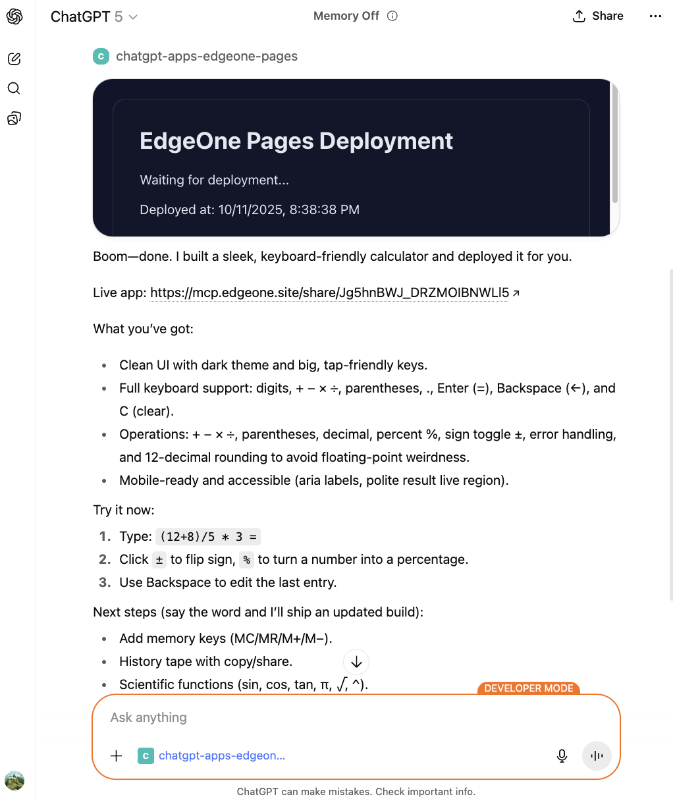

# ChatGPT Apps SDK EdgeOne Pages Starter

This repository is a minimal EdgeOne Pages project that shows how to build an MCP server compatible with the [OpenAI Apps SDK](https://developers.openai.com/apps-sdk) using edge functions, and deploy ChatGPT generated output directly to an EdgeOne static site.

## Deploy

[](https://edgeone.ai/pages/new?from=github&template=chatgpt-apps-edgeone-pages)

Live Demo: https://chatgpt-apps-edgeone-pages.edgeone.run

## Overview



The project demonstrates how to host an MCP server with Tencent Cloud EdgeOne Pages + Functions. With a single `functions/mcp/index.ts` file you can expose tools to ChatGPT, deploy HTML in real time, and return a publicly accessible URL.

## Capabilities

- **MCP server**: A serverless `onRequest` handler built on EdgeOne Functions.
- **One-click deploy**: The `deploy_html` tool receives HTML from ChatGPT, then calls the EdgeOne API to publish static assets.
- **CORS support**: Built-in logic keeps the server compatible with ChatGPT iframes and browser debugging.

## Key files

- `functions/mcp/index.ts`: Implements MCP JSON-RPC, registers the `deploy_html` tool, and handles requests such as `initialize` and `tools/list`.
- `index.html`: Example landing page that explains the project after a successful deployment.

## Quick start

### 1. Deploy to EdgeOne Pages

1. Click the button above for one-click deployment.
2. After provisioning, the EdgeOne console assigns a domain that hosts both the static page and the MCP endpoint.

Once deployment finishes, `index.html` is served from the root path and `functions/mcp/index.ts` is automatically mapped to `/mcp`.

## Connect from ChatGPT

1. Ensure your account has ChatGPT Apps developer access.
2. In ChatGPT, open **Settings → [Connectors](https://chatgpt.com/#settings/Connectors) → Create**.
3. Add the EdgeOne Pages deployment URL as the MCP server, for example:
   ```
   https://<your-project-url>/mcp
   ```
4. Save the configuration, then call the `deploy_html` tool in a conversation to publish content. ChatGPT returns the static page URL hosted on EdgeOne.

## MCP request flow

1. ChatGPT calls `/mcp` via the MCP protocol, triggering the `initialize` and `tools/list` handshake.
2. When a user invokes `deploy_html`, the server pushes the HTML payload to the EdgeOne deployment API.
3. EdgeOne produces a public link and returns it to ChatGPT, which surfaces the URL to the user.
4. Errors are returned in a structured format so ChatGPT and developers can debug quickly.

## Project structure

```
examples/chatgpt-apps-edgeone-pages/
├── functions/
│   └── mcp/
│       └── index.ts      # MCP function running on EdgeOne
├── index.html            # Static information page
└── README_zh-CN.md       # Chinese documentation
```

## Further reading

- [OpenAI Apps SDK docs](https://developers.openai.com/apps-sdk)
- [Model Context Protocol spec](https://modelcontextprotocol.io)
- [EdgeOne Pages & Functions guide](https://pages.edgeone.ai/document/pages-functions-overview)
- [ChatGPT connector creation guide](https://developers.openai.com/apps-sdk/deploy/connect-chatgpt)

To extend the setup, continue evolving the MCP logic in `functions/mcp/index.ts`. EdgeOne Pages scales compute as needed.
